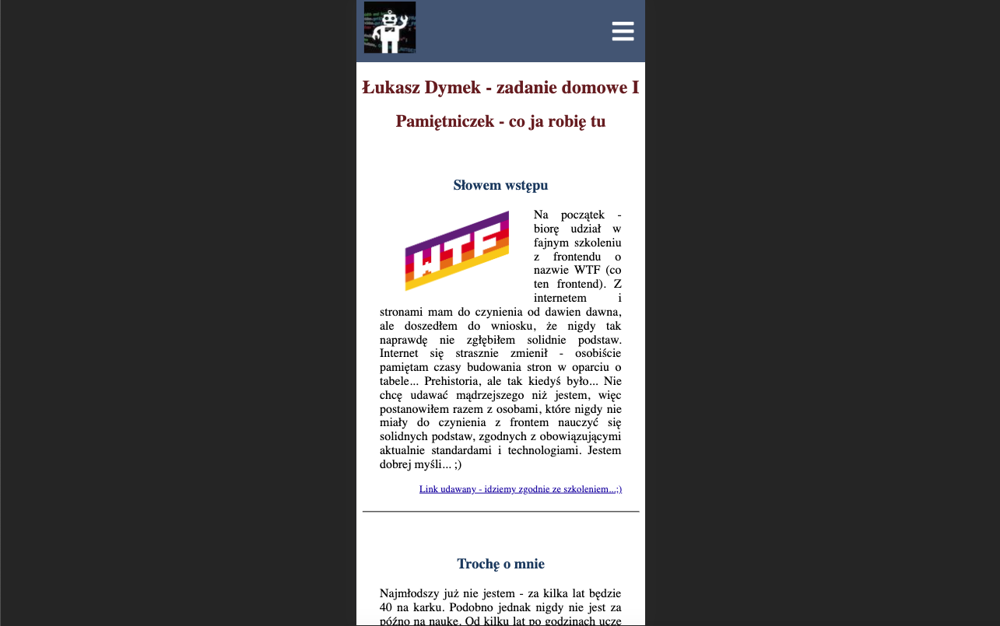

# Strona pisana w ramach nauki frontendu

Jest to część kursu [Co ten frontend](https://cotenfrontend.pl) prowadzonego przez Macieja Korsan

Przy budowie projektu wykorzystywane są następujące technologie i narzędzia:
1. Html 
    - semantyka, semantyka i jeszcze raz semantyka 😀
2. Css
    - flexbox 
    - grid
    - media queries
    - sass
3. Js
    - Node.js
    - NPM
4. Gulp (używam [starter kita](https://github.com/maciejkorsan/wtf-gulp-starter) przygotowanego przez prowadzącego)

W ramach kursu uczę się przede wszystkim dobrych praktyk i solidnych podstaw, których mi naprawdę brakowało. Krok po kroku utrwalam wszystko i uczę się najważniejszych zagadnień frontendu. Poniżej mobilna wersja stronki szkoleniowej (strona budowana jest w oparciu o wytyczne dotyczące responsywności - ma wyglądać poprawnie na wszystkich urządzeniach 🖥).

